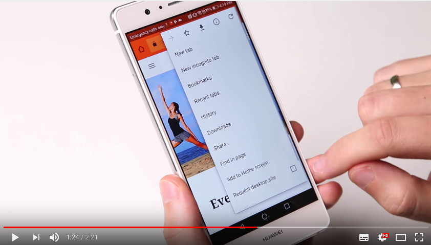
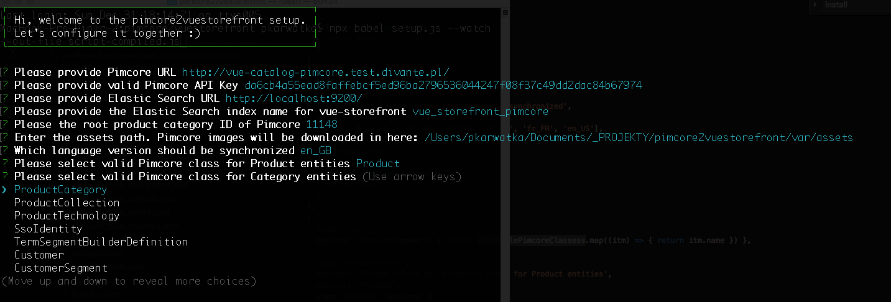
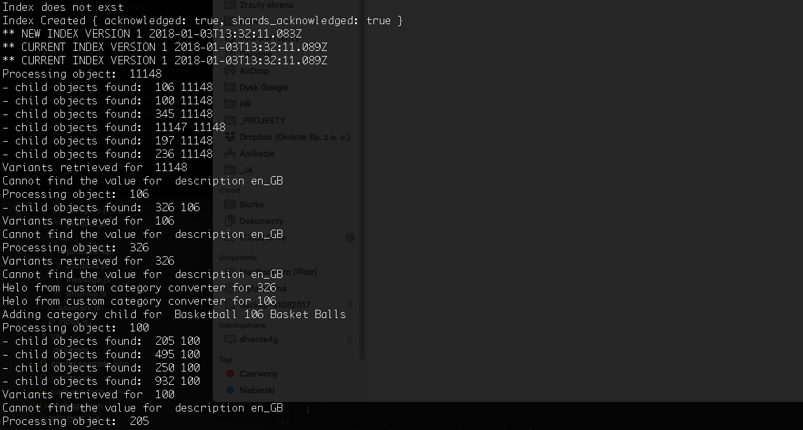
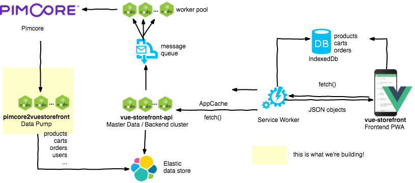
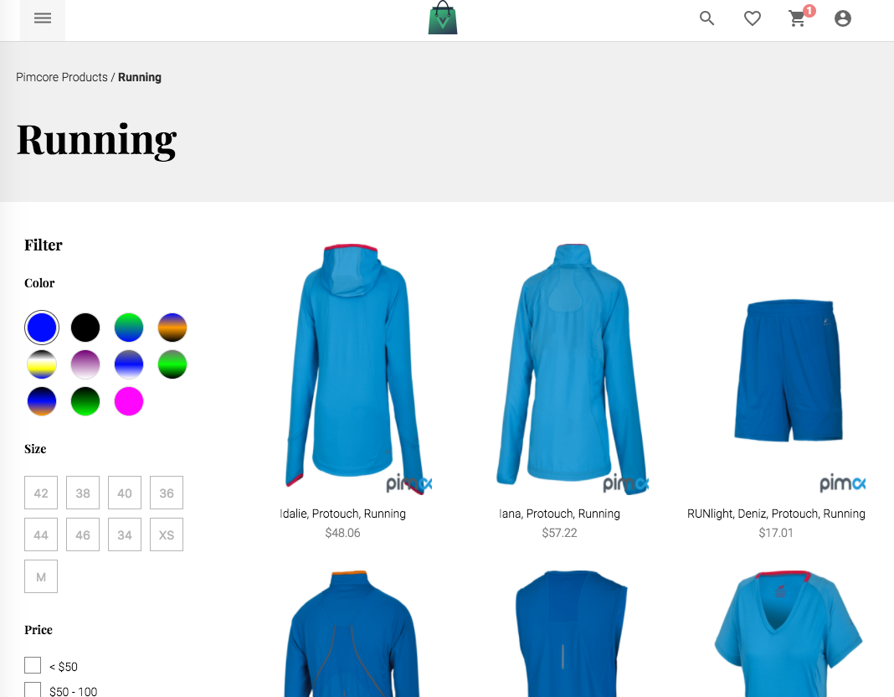
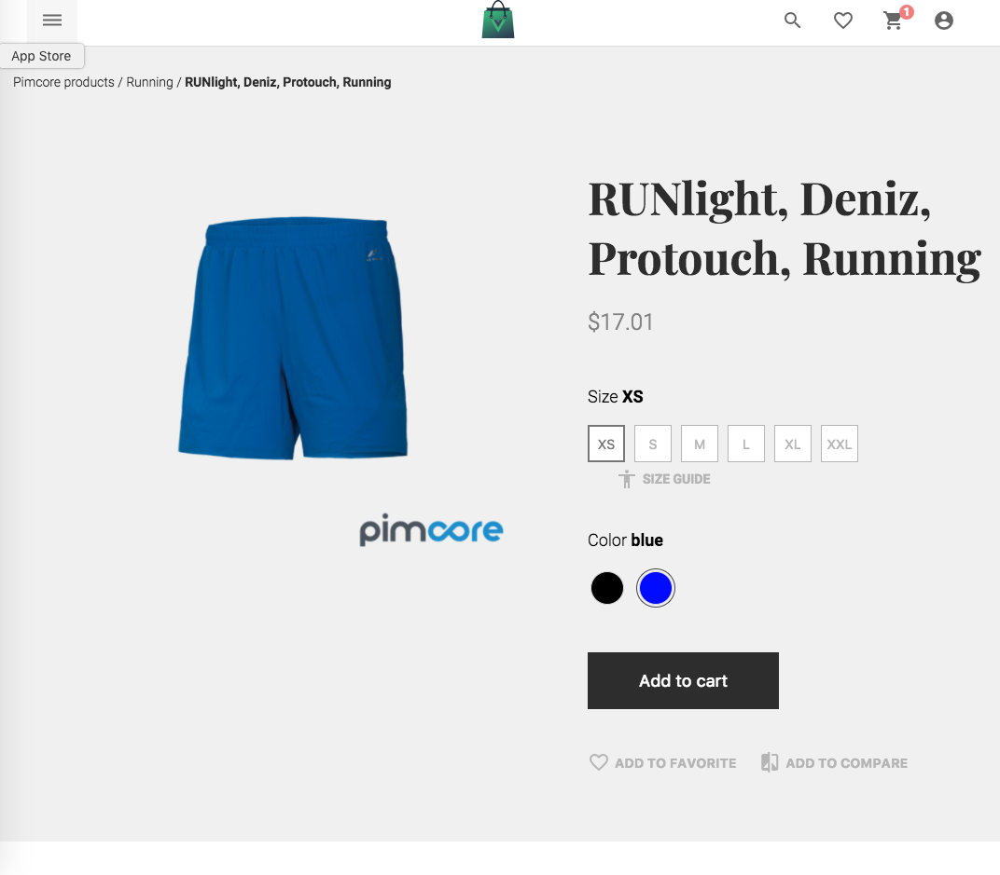

# First Progressive Web App for Pimcore eCommerce Framework
This projects bring You the Pimcore eCommerce Framework support as a backend platform for [Vue Storefront - first Progressive Web App for e-Commerce](https://github.com/DivanteLtd/vue-storefront). 

Vue Storefront is a standalone PWA storefront for your eCommerce, possible to connect with any eCommerce backend (eg. Magento, Pimcore, Prestashop or Shopware) through the API.

[](https://www.youtube.com/watch?v=L4K-mq9JoaQ)

Sign up for a demo at https://vuestorefront.io/ (Vue Storefront integrated with Pimcore OR Magento2).

# Pimcore data bridge
Vue Storefront is platform agnostic - which mean: it can be connected to virtually any eCommerce CMS. This project is a data connector for *Pimcore eCommerce Framework*.
Pimcore data bridge converts Pimcore objects to Vue-storefront data structures (see [Vue Storefront data formats](https://github.com/DivanteLtd/vue-storefront/blob/master/doc/ElasticSearch%20data%20formats.md)). 
You can check [Magento2vuestorefront bridge](https://github.com/DivanteLtd/mage2vuestorefront) for reference as well, however the architecture of these tools differs in many aspects as the CMSes were designed with different philosophies.

We're using Pimcore Web API without direct database access, therefore this bridge works well with both: Pimcore 4 and Pimcore 5.

# Setup and installation
The project contains very straightforward installer:

```
git clone https://github.com/DivanteLtd/pimcore2vuestorefront.git p2v
cd p2v
npm install
node setup.js
```

Please prepare the following information required by the installer:
- Pimcore base URL which eCommerce Framework installed,
- local Elastic Search installation data (index name + URL); please do [install vue-storefront](https://github.com/DivanteLtd/vue-storefront/blob/master/doc/Installing%20on%20Linux%20and%20MacOS.md) to have docker based Elastic Search and redis ready to go!
- ID of the root category (if you're using Pimocore demo's data set: https://github.com/pimcore/demo-ecommerce - it's: 11148)



**If the setup process went fine, the import process should have started automatically.**




# Manual commands
The bridge works on temporary, versioned ES indexes. You decide when the index should be published (when all data objects are properly set).

Create new version of index (for example: vue_pimcore_1): 
```
node index.js new
```

Publish new version of index (creates an alias with prod. name of the index: vue_pimcore_1 -> vue_pimcore): 
```
node index.js publish
```

All the list-based commands (like indexing list of products or categores) support `--limit`, `--offset`, `--switchPage=true` parameters.
The following commands works on temp indexes - so you can publish index in v. 1 and then work on v. 2 without disturbing users with partially indexed products or categories.

Index categories: 
```
node index.js categories --limit=50 --offset=0
```

Index products: 
```
node index.js products --limit=20 --offset=0
```

Index tax rules: 
```
node index.js taxrulse
```


# Data formats and architecture
As Pimcore is a very extensible Framework, the data structures and format may vary. By default we do support official eCommerce Framework data structures which you can check in [Pimcore Advanced eCommerce demo](https://pimcore.com/en/try).
For demonstration purposes we do support pretty basic elements of eCommerce Framework data structures:
- set of required attributes,
- categories,
- products: localized attributes, single photo (can be easily extendend), variants, prices.




# Screenshots

Please visit [Vue Storefront site](http://vuestorefront.io) to check out why it's so cool!



As you may observed, configured products do work perfectly well after imported to Vue Storefront!



# Customization
Architecture is very flexible, based on JSON templates for entities and attributes, using dynamic Strategy and Decorator design patterns.

If you wan't to map custom attributes or sub-objects you need just to:

1. Add custom mapper as copy of `importers/product.js` or `importers/category.js`. For example, you can create a speciall class under `./importers/my-product-importer.js`:

```js
const _ = require('lodash');
const attribute = require('../lib/attribute')

module.exports = class {
    constructor(config, api, db) {
        this.config = config
        this.db = db
        this.api = api
        this.single = this.single.bind(this)
    }

    /**
     * This is an EXAMPLE of custom Product / entity mapper; you can write your own to map the Pimcore entities to vue-storefront data format (see: templates/product.json for reference)
     * @returns Promise
     */
    single(pimcoreObjectData, convertedObject, childObjects, level = 1, parent_id = null) {
        return new Promise((resolve, reject) => {
            console.debug('Helo from custom product converter for', convertedObject.id)
            convertedObject.url_key = pimcoreObjectData.key // pimcoreObjectData.path?
            convertedObject.type_id = (childObjects.length > 0) ? 'configurable' : 'simple'

            let elements = pimcoreObjectData.elements
            let features = elements.find((elem) => elem.name === 'features')
            let categories = elements.find((elem) => elem.name === 'categories')
            let images = elements.find((elem) => elem.name === 'images')
            let materialComposition = elements.find((elem) => elem.name === 'materialComposition')
            let color = elements.find((elem) => elem.name === 'color')
            let gender = elements.find((elem) => elem.name === 'gender')
            let size = elements.find((elem) => elem.name === 'size')

            let localizedFields = elements.find((itm)=> { return itm.name === 'localizedfields'})
            
            let subPromises = []            
            Promise.all(subPromises).then(results => {
                resolve({ src: pimcoreObjectData, dst: convertedObject }) // after all the mapping processes have been executed - we can just give back the controll to master process
            }).catch((reason) => { console.error(reason) })
        })
    }
}

```

2. Modify the `index.js` base methods to use this new strategy. For example:

**CHANGE:**
```js
   importListOf('product', new BasicImporter('product', new ProductImpoter(config, api, client), config, api, client), config, api, offset = cli.options.offset, count = cli.options.limit, recursive = false).then((result) => 
```

**TO:**
```js
   const MyProductImporter = require('./importers/my-product-importer.js')
   importListOf('product', new BasicImporter('product', new MyProductImpoter(config, api, client), config, api, client), config, api, offset = cli.options.offset, count = cli.options.limit, recursive = false).then((result) => 
```
# Templates
Another way to extend or customize this bridge is to change the entities and attributes templates as you can find under `./src/importers/templates`. Templates base on Vue-storefront expected data formats and can be customized just by editing the files.

Each custom Pimcore element is mapped to attribute regarding it's name (for example `attribute_code_color`) or type (eg. `attribute_type_select.json`). Color and size are kind of special attributes because Vue Storefront configurable products by default use for products customization. This is the reason we've prepared templates for these particular attributes. Other ones are created just by adjusting the specific element type.

# TODO
A lot of features and things are to be added! For sure we should work on the performance and parallel processing. You can take a look at [Issues](https://github.com/pimcore/demo-ecommerce/issues) and pick some of them for your first Pull Requests!

# Licence 
Pimcore2vuestorefront source code is completely free and released under the [MIT License](https://github.com/DivanteLtd/vue-storefront/blob/master/LICENSE).

